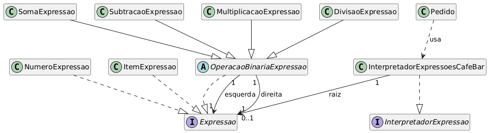

# PadroesComportamentais-Interpreter
# Interpreter — Sistema de Interpretação de Expressões para Cafeteria

<p align="center">
		<a href="https://www.ufjf.br/" rel="noopener">
				
		</a>
</p>

<h3 align="center">DCC078-2025.3-A — Aspectos Avançados em Engenharia de Software (UFJF/ICE)</h3>

---

## 📝 Sumário
- [Sobre](#sobre)
- [Diagrama de Classe](#diagrama)
- [Funcionalidades](#funcionalidades)
- [Tecnologias](#tecnologias)
- [Exemplo de Uso](#exemplo)
- [Como Executar e Testes](#testes)
- [Autor](#autor)

## 🧐 Sobre <a name="sobre"></a>
> **Disciplina:** DCC078 – Aspectos Avançados em Engenharia de Software   </br>
> **Projeto:** Demonstração do padrão Interpreter aplicado a um sistema de pedidos e cardápio   </br>
> **Docente:** Prof. Marco Antônio Pereira Araújo  </br>
> **Data de entrega:** 07/12/2025   </br>
> **Aluno:** [Gabriel Campos Lima Alves](#autor)  </br>

### Padrão Interpreter
Implementação do padrão **Interpreter** aplicada a um sistema de cafeteria que interpreta expressões de cálculo de pedidos. O foco é representar e avaliar gramáticas simples (números, operadores e itens do cardápio) de maneira extensível e testável. Demonstra:
- Interpretação de expressões numéricas e nomes do cardápio (`ESPRESSO`, `LATTE`, `SANDUICHE`, etc.)
- Conversão de tokens para RPN (shunting-yard) e construção de árvore de expressões
- Avaliação separada da lógica de negócio (`Pedido`) e do interpretador (`InterpretadorExpressoesCafeBar`)
- Mensagens de erro padronizadas para tokens inválidos e expressões malformadas
- Facilidade para estender a gramática e adicionar novos itens ao cardápio

Também há uma interface web de demonstração interativa incluída: [Interface de Demonstração local](docs/interpreter.html)
<p align="center">
		
</p>

## 📐 Diagrama de Classe <a name="diagrama"></a>
O diagrama abaixo representa a arquitetura do projeto, enfatizando o padrão **Interpreter** e as classes principais:

<p align="center">
		
</p>

## 🚀 Funcionalidades <a name="funcionalidades"></a>
### Sistema de Interpretação de Expressões
- **InterpretadorExpressao**: interface que declara `interpretar()`
- **InterpretadorExpressoesCafeBar**: parser e avaliador que suporta números, itens do cardápio, operadores `+ - * /` e parênteses
- **Expressao** (interface) e implementações concretas: `NumeroExpressao`, `ItemExpressao`, `SomaExpressao`, `SubtracaoExpressao`, `MultiplicacaoExpressao`, `DivisaoExpressao` e `OperacaoBinariaExpressao`
- **Pedido**: monta expressões a partir de quantidades de itens e utiliza o interpretador para calcular o total

### Características
- Tokenização robusta e conversão para RPN
- Detecção e lançamento de exceções com mensagens:
	- "Expressão com elemento inválido" para token desconhecido
	- "Expressão inválida" para expressões malformadas
- Cardápio configurável com preços e fácil extensão
- Testes unitários com JUnit 5 cobrindo os fluxos principais

### Recursos
- ✅ Implementação completa do padrão Interpreter
- ✅ Avaliação de expressões com itens do cardápio
- ✅ Tokenização, RPN e montagem de árvore de Expressões
- ✅ Tratamento de erros consistente com mensagens definidas
- ✅ Integração com `Pedido` para calcular totais automaticamente
- ✅ Interface web interativa para demonstração prática

## 🛠️ Tecnologias <a name="tecnologias"></a>
- **Java 11+**
- **JUnit 5** - Framework de testes
- **Maven** - Gerenciamento de dependências e build
- **HTML5/CSS3/JavaScript** - Interface web de demonstração (em `docs/interpreter.html`)
- **Git** - Controle de versão

## 📊 Exemplo de Uso <a name="exemplo"></a>
```java
// Monta um pedido e calcula usando o interpretador
Pedido pedido = new Pedido();
pedido.setQtdCafe(2);        // 2 * ESPRESSO (3.0) = 6.0
pedido.setQtdSanduiche(1);   // 1 * SANDUICHE (2.0) = 2.0

double total = pedido.calcularTotal();
System.out.println("Total do pedido: " + total); // Total do pedido: 8.0
```

**Exemplo direto do interpretador:**
```java
InterpretadorExpressao interpretador = new InterpretadorExpressoesCafeBar("2 * ESPRESSO + 1 * SANDUICHE");
double resultado = interpretador.interpretar(); // 8.0
```

**Erros esperados (mensagens padronizadas):**
```
Expressão com elemento inválido
Expressão inválida
```

## 🧪 Como Executar e Testes <a name="testes"></a>
### Pré-requisitos
- Java 11 ou superior
- Maven 3.6+
- Python 3 (opcional, para servir a interface web localmente)

### Comandos
```bash
# Compilar o projeto
mvn clean compile

# Executar todos os testes
mvn test

# Executar teste específico (exemplo)
mvn test -Dtest=padroescomportamentais.interpreter.InterpretadorExpressaoTest

# Empacotar
mvn package

# Servir a interface localmente (em outro terminal)
python3 -m http.server 8000 --directory docs
```

### Testes Inclusos
- **InterpretadorExpressaoTest**: Testes unitários cobrindo
	- Soma, subtração, multiplicação e divisão de números
	- Combinações de operações com precedência
	- Interpretação de itens do cardápio
	- Expressões com quantidades e itens
	- Exceções para elementos inválidos e expressões malformadas

Total: vários testes automatizados com JUnit 5 (ver `src/test/java`)

**Resultado dos testes (exemplo):**
```
Tests run: X, Failures: 0, Errors: 0, Skipped: 0
BUILD SUCCESS
```

## 👨‍💻 Autor <a name="autor"></a>
**Gabriel Campos Lima Alves**  
Matrícula: 202176005  
Email: campos.gabriel@estudante.ufjf.br  
GitHub: [@CamposCodes](https://github.com/CamposCodes)

---

*Projeto de uso acadêmico exclusivo para a disciplina DCC078 - UFJF*
